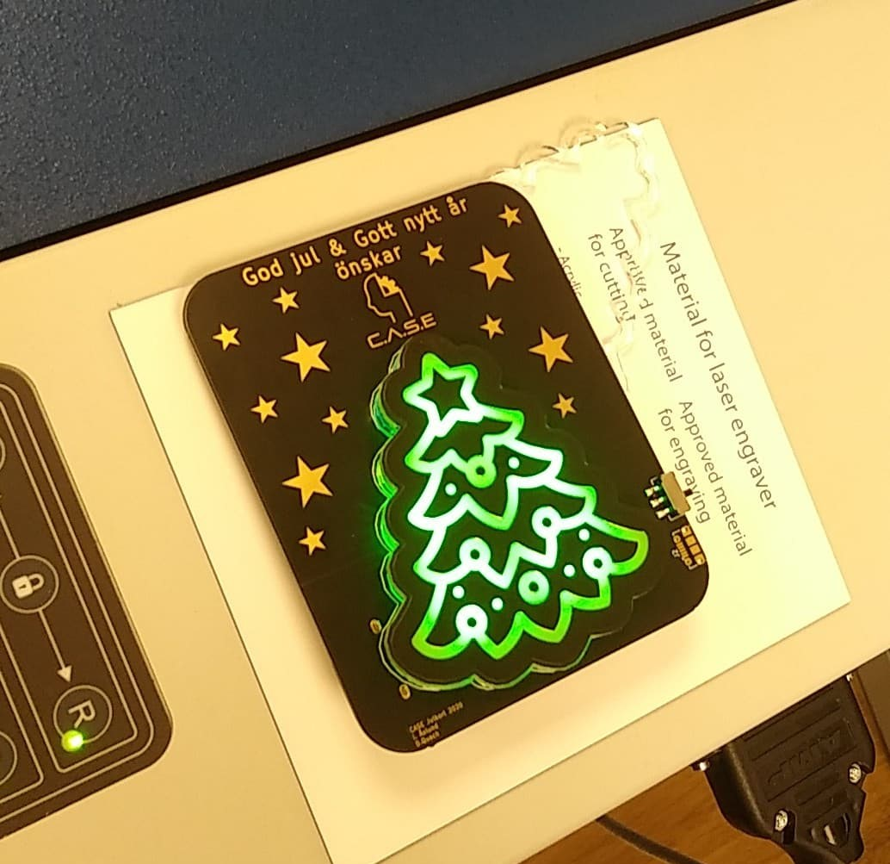

# christmas-cards
Collection of Christmas cards designed over the years. Explore a collection of Christmas cards meticulously crafted over the years, each one bearing a unique design. Originating during our time on the board for CASE (Chalmers Autonomous System and Electronics), these cards have evolved into a personal tradition. Featuring Christmas-themed printed circuit boards (PCBs) adorned with special functionalities, such as blinking LEDs and questionable buzzer music. The contributors usually consist of @Muoshy as project lead and in charge of the electrical design. @adaand00 has managed the software and graphical design aspects, while @johanwheeler has handled the mechanical design and assembly. 

## Quick links
Cards:
- [2020 - Christmas Tree LED stand](https://github.com/CASE-Association/christmas-cards/tree/main/2020)
- [2021 - Reindeer Volume Meter](https://github.com/CASE-Association/christmas-cards/tree/main/2021)
- [2022 - Christmas Banana Synth](https://github.com/adaand00/christmas-banana-synth)
- [2023 - LED Matrix Fireplace](https://github.com/johanwheeler/ch32-fireplace)

## Christmas Cards

| Image | Name | Description | Contributors | 
| --- | --- | --- | --- |
|  | [2020 - Christmas Tree LED stand](https://github.com/CASE-Association/christmas-cards/tree/main/2020) | Designed as two PCBs. A back PCB with USB connector and LEDs. The front PCB has exposed FR4 in a Christmas tree pattern that lights up. | Daniel Quach @Muoshy |
|  | [2021 - Reindeer Volume Meter](https://github.com/CASE-Association/christmas-cards/tree/main/2021) | Fully analog volume meter on a reindeer PCB using op amps. Same principle as [Sonus7](https://github.com/Muoshy/Sonus7) but downscaled. | Daniel Quach @Muoshy     Adam Anderson @adaand00 |
|  | [2022 - Christmas Banana Synth](https://github.com/adaand00/christmas-banana-synth) | Stylophone synthesizer with 24 keys and a buzzer for sound. 12 built-in songs available. |  Daniel Quach @Muoshy     Adam Anderson @adaand00 |
|  | [2023 - LED Matrix Fireplace](https://github.com/johanwheeler/ch32-fireplace) | LED Matrix Fireplace with animations and sound |  Daniel Quach @Muoshy     Adam Anderson @adaand00     Johan Wheeler @johanwheeler|

